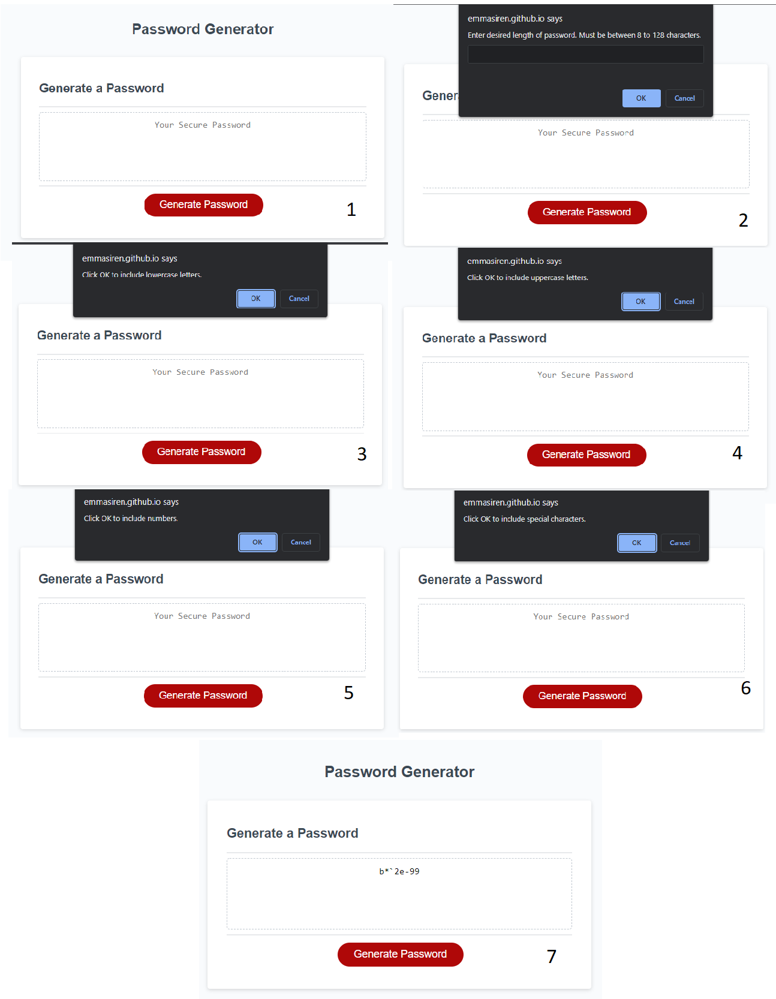

# <Refactoring-Password-Generator>
# Refactoring Password Generator

## Description

This application will show the refactoring of existing code to generate a random password based on user input. The starter code provided lacked the function to prompt user for selection, a randomizer, and a way to display the generated password in the correct field. I began by adding prompts for the user to determine the length of the password within parameters I set. I also made sure the application did not continue until the input was within set parameters. Once the length was selected between 8 to 128 characters, I included CONFIRM prompts to ask the user to include or exclude lowercase or uppercase letters, numbers, and special characters. I added the randomizer function to generate a random array of characters then set it to a string value in order to display the generated password in the correct format. The code has detailed comments on how each line of code works and why it is necessary to ensure the functions perform correctly. I only worked on the JavaScript code provided. 

---
## Usage

To view the website application please follow the provided link:
https://emmasiren.github.io/Refactoring-Password-Generator/

The following image shows the web application when loaded correctly and at every prompt then finally the expected result.

